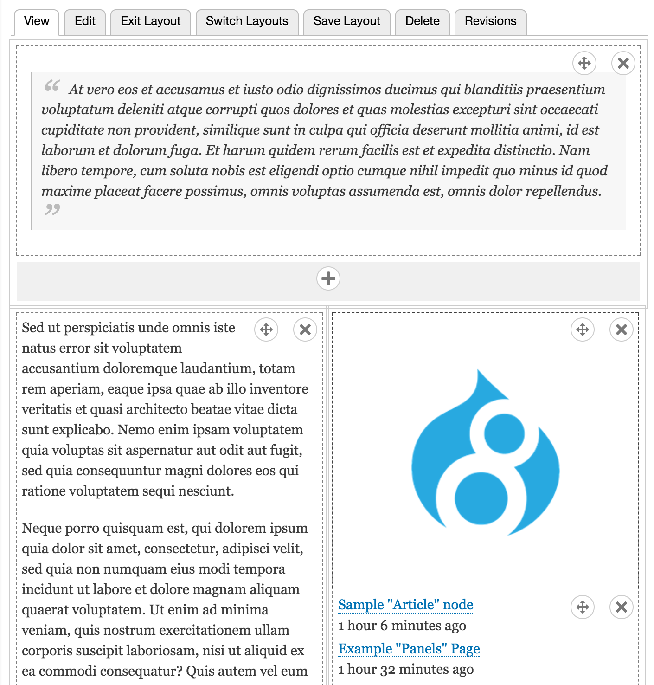

# Layout Per Node
#### This module allows content builders to select between node layouts and to assign reusable content (blocks) and page-specific content (fields) via a drag-and-drop UI.

Layout Per Node ([layout_per_node](https://www.drupal.org/project/layout_per_node)), a project from developers at the University of Texas, sets out to solve one of the central goals of Drupal's [Blocks & Layout Initiative](https://groups.drupal.org/scotch), namely [emphasis ours] to:

> ...bring unity to a system of disjointed output components (blocks, page callbacks, menus, theme settings, and more) and **provide a standardized mechanism of output, new tools for placing content on a page**, and a potential for performance gains amongst other benefits.

And *this* project's goal is to be a content placement tool that is **simple and intuitive**.

If you're familiar with [Panels](https://www.drupal.org/project/panels), you can think of Layout Per Node as "Panels Lite."

This walkthrough summarizes Layout Per Node's content building workflow and its minimal setup & configuration, and then provides commentary on the technical implementation and its niche within the Layout Initiative landscape.

## 1. Content Building
Let's start with the actual use of Layout Per Node: how a content builder would use it, and how it integrates into Drupal's content editing conventions.

We start with a standard Drupal "article" node, consisting of `body` field, `image` field, `tags` field, and `comments` field. Integrated with the `View`, `Edit` and `Delete` tabs is a new `Layout` tab. Clicking on this tab enables the field_layout region overlay, which defaults to the single content region.

The `Switch Layouts` tab now becomes visible; this provides an interface for switching between any of the allowed layouts for the given node type. These layouts are not provided by this module, but are part of the core Layout Discovery system, which allows modules to register their own layouts.

Let's first switch to one of the Drupal-provided two-column layouts.

Next, we place content in the newly visible layout regions using any of the `+` buttons at the base of each region. The `Add Content` overlay provides a listing of both our node-specific content, namely, the body, image, tags, and comments fields, as well as content which is not associated with a specific node, that is, Drupal blocks -- which are separated into custom block types and Views blocks.

`Add content` also shows previews for each available element to better disambiguate content.

Layout Per Node provides the ability to rearrange or remove elements via a drag-and-drop UI. Once we're satisfied, we can choose to `Save Layout`, which creates a new node revision and saves the layout data.

The ability to revision layouts not only enables reverting not just content *and* content placement, but also the ability to draft new content *and content placement* via Drupal's core Workflows module.

## 2. Setup & Configuration
Now that we've seen the end product, let's see what it takes to integrate Layout Per Node in a site. After enabling the module, visit any node type's "Edit" interface. A new `Layout Per Node` vertical tab appears among the others. After ticking the on/off checkbox, a list of all layouts registered via Drupal's Layout Discovery system appears.

Once enabled, a new definition is added to the permissions system for setting the node type's layout. In this sense, 'set layout' is treated as simply another facet of the content building permissions stack, alongside 'create', 'edit', and 'delete' node content. Via these permissions, a given site can allow some users to create content and others to manage its layout; another site could grant separate roles to create and layout content for each distinct node type.

## 3. Differences from Panels and Paragraphs

### Panels
[Panels](https://www.drupal.org/project/panels), combined with In-Place Editor (IPE) and [Page Manager](https://www.drupal.org/project/page_manager), has been and continues to be one of the *de facto* approaches to content layout. It is perhaps the most comprehensive approach, allowing fine-grained control over elements such as field labels, Views contextual filters, and view modes.

Its architecture is based on per-page-variant approach. Via Page
Manager, one can create a page variant that would apply to all nodes, or to
all nodes of a specific content type, or even to a single node ID. **The variant
must, however, be defined**. This level of control is typically the purview of a
site builder, rather than a content builder.

Panels exposes all block types provided by all modules immediately, and allows
the ability to create new content via the In-Place Editor.

Layout Per Node differs in the following ways:
1. It takes an opt-in approach for which block types should be made available,
1. It relies on other parts of the system, such as the Block interface or the node
edit page, for creating content,
1. And it does not allow per-instance configuration of blocks (for example, whether or not to display the block title)

Perhaps the most signficant difference, however, is how Panels & Layout Per Node handle fields:
- Panels allows placing node content on a page via Chaos Tools, which
allows access to entity view modes. From there, the user can choose between any
predefined view mode to render the node content in different variants. However,
this **requires an appropriate view mode -- once again, typically the purview of
site builders, not content builders -- to exist**. As a result, it doesn't
directly allow placement of individual fields separate from each other.

- Layout Per Node thinks of fields and blocks the same way: they are individual
bits of content that are **placeable anywhere within selected layout**.

### Paragraphs
The [Paragraphs](drupal.org/project/paragraphs) module is fast becoming widely adopted as a tool for creating
complex combinations of fields. As a fieldable entity, Paragraph types allow
great variety in clustering multiple fields together, and clever use of
Paragraph fields as layout selectors enables lots of display variance.
However, **Paragraphs itself is not a layout tool, and content builders cannot
arbitrarily place fields within any given region** on a page. Paragraphs work best
for sites where the layout architecture consists of stacked horizontal instances
of field groupings (which is where the 'paragraph' metaphor comes from).

In the context of Layout Per Node, Paragraph types can be used as complex fields
which *can* be placed anywhere on a layout. In the example here, I am placing a
Paragraph type that consists of a headline, image, and copy text as a single
entity within any given region in the layout. **These two modules
can work in a complementary fashion to provide the layout flexibility that
Paragraphs doesn't provide on its own.**

### 4. Coexistence/Extensibility
Layout Per Node's responsibility within the Drupal content building ecosystem is narrow by design:
1. By relying on the `field_layout` paradigm -- and therefore functioning at the node level -- it is not dependent on regions defined by a given theme; indeed Layout Per Node works equally with any theme
1. By relying on the same Layout Discovery system as Panels and [Display Suite](https://drupal.org/project/ds), it can be used in conjunction with them. Panels IPE can be used for one node type, and Layout Per Node can be used for another on the same site.
1. Layouts developed by and for one layout system can be used interchangeably with Layout Per Node, provided they follow Layout Discovery standards.
1. With its lightweight footprint, Layout Per Node can be disabled without affecting underlying content; layout will simply revert to the field layout
defined in the content type.

### 5. Summary of Probable Use Cases
So, given the available layout approaches, which is appropriate when? Here is
a suggested guide:

| Scenario     | Solution |
| :------- | ----: |
| Site builders *are* the content builders & are technically savvy | Panels |
| Site architecture requires fixed variants of page design    | Panels   |
| Some content needs fine-grained control; some needs a simple UI | Panels + Layout Per Node |
| Panels does not feel user-friendly to content builders     | Layout Per Node    |
| Panels grants too much control to content builders     | Layout Per Node    |
| Site architecture requires complex field 'bundles' with limited layout | Paragraphs    |
| Site architecture requires complex field 'bundles' with flexible layout | Paragraphs + Layout Per Node   |

### Download & Support
For more information, visit https://drupal.org/project/layout_per_node

